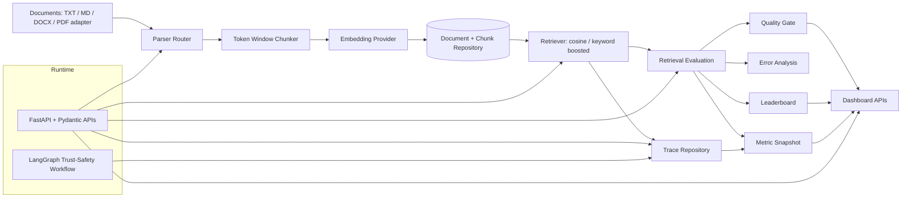

# SignalLens EvalOps

SignalLens EvalOps is a production-shaped AI evaluation and observability platform for RAG systems, retrieval experiments, trace inspection, quality gates, and dashboard reporting.

It is designed to show the work expected from AI Evaluation Engineers, LLMOps teams, and applied AI platform engineers: measurable quality, reproducible experiments, explicit traces, and release gates instead of anecdotal prompt testing.

## 1. Executive Summary

**What it is:** A FastAPI + Pydantic service that ingests documents, chunks and embeds them, stores vectors, retrieves context, evaluates retrieval quality, records traces, generates metrics, runs error analysis, enforces quality gates, and exposes dashboard APIs.

**Why it matters:** Applied AI teams need to know whether a model or retriever change improved quality before it ships. SignalLens turns RAG behavior into measurable artifacts: `Precision@K`, `Recall@K`, `MRR`, `NDCG`, latency, trace IDs, failed checks, recommendations, and leaderboard rankings.

**What it proves:**

- End-to-end EvalOps workflow, not just a notebook.
- Deterministic offline demo with real application services and no API keys.
- API-first design for CI, dashboards, and platform integration.
- Clear boundaries for production adapters: ChromaDB, pgvector, Postgres traces, Langfuse, MLflow, SentenceTransformers, RAGAS, and DeepEval.

**Run the full demo:**

```bash
python demo/evalops_demo.py
```

## 2. Architecture Diagram



## 3. Feature Overview

SignalLens includes the core pieces of an AI evaluation platform:

| Area | What is implemented |
|---|---|
| API framework | FastAPI routes with strict Pydantic request and response schemas |
| Document ingestion | Text, Markdown, DOCX parser, and PDF parser adapter path |
| Chunking | Token-window chunking with overlap and chunk metadata |
| Embeddings | Deterministic local hash embeddings for offline tests and demos; adapter boundary for richer models |
| Vector storage | In-memory repository for local runs; ChromaDB and pgvector adapters staged for production use |
| Retrieval | Repository-backed vector retrieval with cosine and keyword-boosted strategies |
| Evaluation | Retrieval evals with ground-truth query sets and ranking metrics |
| Observability | Trace creation, trace listing, failed trace recording, latency and similarity scores |
| Quality gates | Threshold checks for quality and latency before a run is considered shippable |
| Dashboard APIs | Summary, leaderboard, experiment list, filters, and sort controls |
| Deployment | Dockerfile and minimal AWS ECS Fargate deployment templates |

## 4. Evaluation Features

SignalLens evaluates retrieval quality with metrics that hiring teams expect in RAG and search systems:

- `Precision@K`: How much of the returned context is relevant.
- `Recall@K`: Whether known relevant context was found.
- `MRR`: Whether the first relevant result appears early.
- `NDCG`: Whether relevant results are ranked well across the list.
- Per-query metric rows for debugging individual failures.
- Experiment metadata: dataset name, run name, backend, embedding model, strategy, `top_k`, chunk size, and overlap.
- Benchmark support for comparing chunk sizes, embedding dimensions, retrieval strategies, and top-k settings.
- Offline trust-safety eval runner with accuracy, macro F1, false positive rate, false negative rate, action agreement, and node latency summaries.

Key endpoints:

```text
POST /evaluate/retrieval
GET  /leaderboard
POST /v1/evals/run
GET  /v1/evals/summary
```

## 5. Observability Features

SignalLens treats every retrieval request as inspectable runtime evidence:

- Completed and failed trace recording.
- Trace payloads with query, filters, strategy, and request metadata.
- Retrieved chunk IDs, document IDs, chunk indexes, text, metadata, and similarity scores.
- Retrieval latency, total latency, backend name, embedding model, status, and error message.
- In-memory trace repository for local runs.
- Postgres trace repository for production-shaped persistence.
- Optional Langfuse integration for workflow tracing when credentials are present.

Key endpoints:

```text
POST /traces
GET  /traces
GET  /traces/{trace_id}
GET  /metrics/summary
```

## 6. Quality Gate Features

Quality gates convert evaluation metrics into release decisions:

- `PASSED` or `FAILED` status per experiment.
- Thresholds for `precision_at_k`, `recall_at_k`, `mrr`, `ndcg`, retrieval latency, and similarity score.
- Failed-check payloads with actual value, required value, failure reason, and recommendation.
- Automatic quality gate execution after retrieval evaluation.
- Manual quality check endpoint for CI or external experiment runners.
- Error analysis service that turns poor metrics into actionable remediation guidance.

Key endpoints:

```text
POST /quality/check
GET  /quality/checks
GET  /analysis/failures
```

Example failed check:

```json
{
  "metric": "precision_at_k",
  "actual": 0.3333,
  "required": 0.8,
  "reason": "LOW_PRECISION",
  "recommendation": "Review chunking strategy; evaluate embedding model; apply metadata filtering."
}
```

## 7. Dashboard APIs

The dashboard layer exposes recruiter-readable and engineering-useful summaries over traces, leaderboard entries, and quality gates.

| Endpoint | Purpose |
|---|---|
| `GET /dashboard/summary` | Request volume, success/error rate, latency, and quality gate counts |
| `GET /dashboard/leaderboard` | Ranked experiment table with metrics and quality status |
| `GET /dashboard/experiments` | Experiment cards for filtering by retriever, embedding model, and gate status |

Dashboard filters:

```text
experiment_id
embedding_model
retriever
quality_gate_status
sort_by=precision_at_k|recall_at_k|mrr|ndcg|avg_retrieval_latency_ms
sort_order=asc|desc
```

Example dashboard summary:

```json
{
  "total_traces": 8,
  "successful_requests": 7,
  "failed_requests": 1,
  "success_rate": 0.875,
  "error_rate": 0.125,
  "avg_retrieval_latency_ms": 0.148,
  "p95_retrieval_latency_ms": 0.196,
  "failed_quality_gates": 1,
  "total_quality_checks": 2
}
```

## 8. Example Outputs

The demo prints each platform stage as a separate section.

Document ingestion:

```text
1. DOCUMENT INGESTION
- 01-ingestion-pipeline.md: id=1e93a948 tokens=57 chunks=2 parser=text-parser-v1 latency_ms=0.106
- 02-trace-observability.md: id=379b1547 tokens=47 chunks=2 parser=text-parser-v1 latency_ms=0.073
```

Retrieval evaluation:

```text
6. EVALUATION
Tight run: run_id=demo-tight-keyword-top1 top_k=1 strategy=keyword_boosted precision=1.0000 recall=1.0000 mrr=1.0000 ndcg=1.0000
Broad run: run_id=demo-broad-cosine-top3 top_k=3 strategy=cosine precision=0.3333 recall=1.0000 mrr=1.0000 ndcg=1.0000
```

Error analysis:

```text
9. ERROR ANALYSIS
Broad run failures: 3
- LOW_PRECISION: precision_at_k=0.3333 threshold=0.7500
  recommendation: Reduce chunk size; improve embeddings; apply metadata filtering.
```

Leaderboard:

```text
11. LEADERBOARD GENERATION
1. Tight metadata + keyword boosted | top_k=1 strategy=keyword_boosted precision=1.0000 recall=1.0000 mrr=1.0000 ndcg=1.0000
2. Broad cosine top-3 | top_k=3 strategy=cosine precision=0.3333 recall=1.0000 mrr=1.0000 ndcg=1.0000
```

## 9. Demo Walkthrough

Run:

```bash
python demo/evalops_demo.py
```

The demo completes in seconds and exercises real application services:

1. Ingests three technical documents.
2. Chunks them with token windows and overlap.
3. Generates deterministic local embeddings.
4. Stores vectorized chunks in the repository-backed vector store.
5. Retrieves context for a trace observability query.
6. Evaluates two retrieval configurations.
7. Records completed and failed traces.
8. Generates request, error, latency, and similarity metrics.
9. Runs error analysis on the weaker run.
10. Executes quality gates for both runs.
11. Ranks experiments in a leaderboard.
12. Produces a dashboard summary.

Why this is useful for interviews: a recruiter or hiring manager can see the full EvalOps lifecycle in under three minutes without cloud credentials, model API keys, or external services.

## 10. Resume Impact

SignalLens is built to demonstrate practical AI evaluation engineering:

- Designed an API-first EvalOps platform for RAG ingestion, retrieval benchmarking, trace inspection, quality gates, and dashboard reporting.
- Implemented retrieval evaluation with `Precision@K`, `Recall@K`, `MRR`, `NDCG`, per-query diagnostics, experiment metadata, and leaderboard ranking.
- Built observability primitives for completed and failed traces, similarity scores, latency metrics, request payloads, and retrieved chunk provenance.
- Added automated quality gates that translate evaluation metrics into pass/fail release decisions with remediation guidance.
- Created a deterministic offline demo that exercises real services end to end without mocked outputs or external API keys.
- Maintained production-shaped boundaries for ChromaDB, pgvector, Postgres traces, Langfuse, MLflow, SentenceTransformers, RAGAS, and DeepEval.

## 11. Future Roadmap

Near-term roadmap:

- Add richer semantic embeddings with SentenceTransformers and hosted embedding providers.
- Expand ChromaDB and pgvector production tests with persistent indexes and metadata filters.
- Add generation-quality evaluators for faithfulness, answer relevance, context relevance, and hallucination risk.
- Integrate RAGAS and DeepEval behind the existing evaluation service boundary.
- Log experiment parameters, metrics, and artifacts to MLflow by default in benchmark mode.
- Add CI-friendly quality gate commands for pull requests and retriever configuration changes.
- Build a frontend dashboard over the existing dashboard APIs.
- Add dataset versioning and regression reports for retrieval and generation tasks.
- Extend deployment examples beyond ECS into managed Postgres and observability stacks.

## Local Development

Install and run:

```bash
python3 -m venv .venv
source .venv/bin/activate
pip install -e ".[dev]"
uvicorn app.main:app --reload
```

Install full platform dependencies when working on ChromaDB, pgvector, MLflow, RAGAS, DeepEval, LangChain, PDF parsing, or SentenceTransformers:

```bash
pip install -e ".[platform,dev,docs]"
```

Run tests:

```bash
pytest
```

Run the API:

```bash
curl http://127.0.0.1:8000/health
curl http://127.0.0.1:8000/dashboard/summary
```

## Current API Surface

```text
GET  /health
GET  /v1/policy
POST /v1/analyze
POST /v1/evals/run
GET  /v1/evals/summary
POST /v1/rag/ingest
POST /v1/rag/ingest/upload
POST /retrieve
POST /evaluate/retrieval
GET  /leaderboard
POST /traces
GET  /traces
GET  /traces/{trace_id}
GET  /metrics/summary
GET  /analysis/failures
POST /quality/check
GET  /quality/checks
GET  /dashboard/summary
GET  /dashboard/leaderboard
GET  /dashboard/experiments
```
