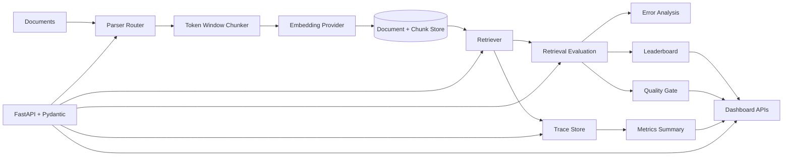

# SignalLens EvalOps 2.0

SignalLens EvalOps is a production-shaped AI evaluation and observability platform for RAG systems. It turns retrieval behavior into measurable artifacts: traces, ranking metrics, quality gates, error analysis, dashboards, and benchmark reports.

The project is intentionally runnable without model API keys or cloud services. The local stack uses deterministic embeddings and in-memory repositories so the full EvalOps loop can be reviewed, tested, and demoed in minutes.

## What It Demonstrates

- RAG document ingestion with parsing, chunking, embedding, and storage.
- Retrieval APIs with cosine and keyword-boosted strategies.
- Retrieval evaluation with `Precision@K`, `Recall@K`, `MRR`, and `NDCG`.
- Trace capture for completed and failed requests.
- Metrics summaries for latency, success rate, error rate, and retrieval volume.
- Error analysis that turns poor retrieval results into remediation guidance.
- Quality gates that convert metrics into pass/fail release decisions.
- Dashboard APIs for experiment summaries, leaderboard views, and filtering.
- Production adapter boundaries for ChromaDB, pgvector, Postgres traces, Langfuse, MLflow, SentenceTransformers, RAGAS, and DeepEval.

## Architecture




## Quickstart

```bash
python3 -m venv .venv
source .venv/bin/activate
pip install -e ".[dev]"
python demo/evalops_demo.py
```

The demo exercises the implemented services end to end:

1. Ingests sample documents.
2. Splits them into overlapping token windows.
3. Generates deterministic local embeddings.
4. Stores vectorized chunks.
5. Runs retrieval.
6. Evaluates two retrieval configurations.
7. Records successful and failed traces.
8. Generates metrics.
9. Runs failure analysis.
10. Applies quality gates.
11. Updates the leaderboard.
12. Produces dashboard summaries.

Expected demo shape:

```text
Tight run: precision=1.0000 recall=1.0000 mrr=1.0000 ndcg=1.0000
Broad run: precision=0.3333 recall=1.0000 mrr=1.0000 ndcg=1.0000
Tight run: PASSED failed_checks=0
Broad run: FAILED failed_checks=1
```

## Run The API

```bash
uvicorn app.main:app --reload
```

Open the generated API docs:

```text
http://127.0.0.1:8000/docs
```

Smoke test:

```bash
curl http://127.0.0.1:8000/health
curl http://127.0.0.1:8000/dashboard/summary
```

## Example API Flow

Ingest a document:

```bash
curl -X POST http://127.0.0.1:8000/v1/rag/ingest \
  -H "Content-Type: application/json" \
  -d '{
    "document_name": "policy.md",
    "content": "SignalLens traces retrieval requests, chunks, scores, latency, and quality decisions.",
    "content_type": "text/markdown",
    "metadata": {"topic": "observability"}
  }'
```

Retrieve chunks:

```bash
curl -X POST http://127.0.0.1:8000/retrieve \
  -H "Content-Type: application/json" \
  -d '{
    "query": "What does SignalLens trace?",
    "top_k": 3,
    "strategy": "keyword_boosted"
  }'
```

Run a retrieval benchmark:

```bash
curl -X POST http://127.0.0.1:8000/evaluate/retrieval \
  -H "Content-Type: application/json" \
  -d '{"dataset_name": "local-ground-truth", "run_benchmark_grid": true}'
```

Inspect results:

```bash
curl http://127.0.0.1:8000/leaderboard
curl http://127.0.0.1:8000/traces
curl http://127.0.0.1:8000/metrics/summary
curl http://127.0.0.1:8000/analysis/failures
curl http://127.0.0.1:8000/quality/checks
```

## API Surface

| Endpoint | Purpose |
|---|---|
| `GET /health` | Service health and version metadata |
| `GET /v1/policy` | Trust-safety policy fixture |
| `POST /v1/analyze` | Deterministic trust-safety workflow analysis |
| `POST /v1/evals/run` | Offline trust-safety evaluation run |
| `GET /v1/evals/summary` | Latest trust-safety evaluation summary |
| `POST /v1/rag/ingest` | JSON document ingestion |
| `POST /v1/rag/ingest/upload` | Raw body document ingestion |
| `POST /retrieve` | Retrieve ranked chunks with scores and latency |
| `POST /evaluate/retrieval` | Evaluate retrieval against ground truth or benchmark grid |
| `GET /leaderboard` | Ranked retrieval experiment leaderboard |
| `POST /traces` | Create a trace record |
| `GET /traces` | List traces with filters and pagination |
| `GET /traces/{trace_id}` | Fetch one trace |
| `GET /metrics/summary` | Aggregate request, latency, and retrieval metrics |
| `GET /analysis/failures` | List retrieval failure analyses |
| `POST /quality/check` | Run a manual quality gate check |
| `GET /quality/checks` | List quality gate results |
| `GET /dashboard/summary` | Dashboard-level summary metrics |
| `GET /dashboard/leaderboard` | Dashboard leaderboard with sorting and filters |
| `GET /dashboard/experiments` | Experiment cards for dashboard views |

## Repository Map

```text
app/api/          FastAPI routes and Pydantic schemas
app/rag/          Parsers, chunking, embeddings, ingestion service
app/retrieval/    Retrieval service, evaluation, adapters, benchmark, leaderboard
app/traces/       Trace models, repositories, and service
app/metrics/      Metrics aggregation
app/analysis/     Failure analysis service
app/quality/      Quality gate models and checks
app/dashboard/    Dashboard summary and experiment views
app/storage/      In-memory document and chunk repositories
demo/             End-to-end local demo and screenshots
docs/             API, architecture, schema, roadmap, and positioning notes
reports/          Generated evaluation and benchmark reports
tests/            Unit and API tests
deploy/aws/       Minimal ECS Fargate deployment templates
```

## Implemented Metrics

| Metric | Use |
|---|---|
| `Precision@K` | Measures how many retrieved chunks are relevant |
| `Recall@K` | Measures whether known relevant chunks or documents were found |
| `MRR` | Rewards placing the first relevant result early |
| `NDCG` | Measures ranking quality across the result list |
| Retrieval latency | Captures request-time performance |
| Similarity score | Tracks retrieval confidence and score quality |
| Success/error rate | Summarizes operational behavior across traces |

## Quality Gates

Quality gates compare experiment metrics against configurable thresholds:

- `QUALITY_PRECISION_THRESHOLD`
- `QUALITY_RECALL_THRESHOLD`
- `QUALITY_MRR_THRESHOLD`
- `QUALITY_NDCG_THRESHOLD`
- `QUALITY_LATENCY_THRESHOLD_MS`
- `QUALITY_SIMILARITY_THRESHOLD`

Failed checks return the metric, actual value, required value, failure reason, and recommendation. This makes the release decision inspectable instead of anecdotal.

Example failed check:

```json
{
  "metric": "precision_at_k",
  "actual": 0.3333,
  "required": 0.8,
  "reason": "LOW_PRECISION",
  "recommendation": "Review chunking strategy; evaluate embedding model; apply metadata filtering."
}
```

## Configuration

Local defaults work out of the box. Environment variables can switch storage, tracing, and evaluation behavior.

| Variable | Default | Purpose |
|---|---:|---|
| `APP_ENV` | `local` | Runtime environment label |
| `CHUNK_SIZE_TOKENS` | `180` | Default chunk size |
| `CHUNK_OVERLAP_TOKENS` | `30` | Default chunk overlap |
| `LOCAL_EMBEDDING_DIMENSIONS` | `384` | Deterministic local embedding dimensions |
| `VECTOR_BACKEND` | `memory` | Vector storage backend |
| `EMBEDDING_PROVIDER` | `local-hash` | Embedding provider |
| `TRACE_STORAGE_BACKEND` | `memory` | Trace storage backend |
| `RETRIEVAL_LEADERBOARD_PATH` | `reports/retrieval_leaderboard.json` | Leaderboard artifact path |
| `LANGFUSE_PUBLIC_KEY` | unset | Optional Langfuse public key |
| `LANGFUSE_SECRET_KEY` | unset | Optional Langfuse secret key |
| `MLFLOW_ENABLED` | `false` | Optional MLflow artifact logging |

For the full list, see `app/core/config.py`.

## Optional Platform Dependencies

The base install is lightweight. Install platform extras when working on production adapters or third-party evaluator integrations:

```bash
pip install -e ".[platform,dev,docs]"
```

Included optional integration boundaries:

- ChromaDB vector persistence.
- pgvector-backed retrieval.
- Postgres trace storage.
- MLflow experiment logging.
- SentenceTransformers embeddings.
- RAGAS and DeepEval evaluation integration.
- PDF and DOCX parsing support.

## Tests And Quality Checks

```bash
.venv/bin/python -m pytest
.venv/bin/python -m ruff check .
```

Current local verification:

```text
47 tests passed
Ruff checks passed
End-to-end demo completed
```

## Reports And Docs

- `reports/week1_eval_summary.md` - baseline trust-safety evaluation.
- `reports/retrieval_benchmark_sprint2.md` - retrieval benchmark grid output.
- `reports/retrieval_leaderboard.json` - serialized leaderboard artifact.
- `docs/api.md` - detailed API examples.
- `docs/database-schema.md` - proposed persistence schema.
- `docs/signalLens-2-architecture.md` - architecture notes for SignalLens 2.0.
- `docs/mvp-roadmap.md` - staged product roadmap.
- `docs/github-positioning.md` - repository positioning and talking points.

## Roadmap

- Add richer semantic embeddings with SentenceTransformers and hosted providers.
- Expand persistent ChromaDB and pgvector tests.
- Add generation-quality evaluators for faithfulness, answer relevance, and hallucination risk.
- Integrate RAGAS and DeepEval behind the existing evaluation service boundary.
- Log benchmark parameters, metrics, and artifacts to MLflow by default.
- Add CI-friendly quality gate commands for pull requests.
- Build a frontend dashboard on top of the existing dashboard APIs.
- Add dataset versioning and regression reports for retrieval and generation tasks.

## Resume Summary

SignalLens EvalOps 2.0 demonstrates an API-first AI evaluation platform for RAG systems: ingestion, retrieval, ranking metrics, traces, quality gates, failure analysis, dashboard APIs, benchmark artifacts, and production adapter boundaries. It is built to show practical LLMOps and EvalOps engineering, not just prompt experimentation.
